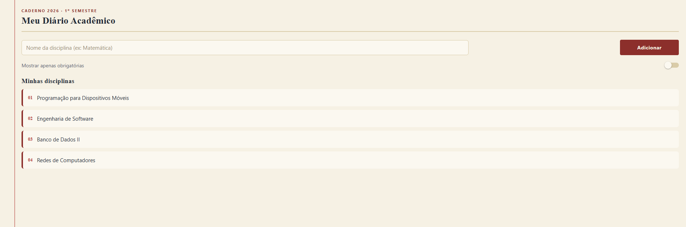

# Atividade 01 — MeuDiarioAcademico (pratica04)

Disciplina: Programação para Dispositivos Móveis (React Native / Expo)
Professor: Marcelo Alves Farias — IESB

## Comando usado para criar o projeto

```bash
npx create-expo-app@latest MeuDiarioAcademico --template blank
```

## Como rodar

```bash
cd MeuDiarioAcademico
npm install
npx expo start
```

Depois é só escanear o QR Code com o app **Expo Go** (Android/iOS) ou pressionar
`a` no terminal para abrir no emulador Android.

## O que foi implementado

- **`labels.js`** na raiz, exportando as constantes de texto (título do app,
  placeholder do input, texto do botão, título da lista, texto do switch) —
  importadas em `App.js` via `import { ... } from './labels'`.
- **`SafeAreaView`** importado de `react-native-safe-area-context` (não o
  antigo do `react-native`), envolvido por `SafeAreaProvider`.
- **Cabeçalho** com o título do app.
- **Linha (`flexDirection: 'row'`)** com `TextInput` (~68% de largura, usando
  `width: '68%'`) e um `Pressable` "Adicionar" (~28%, usando `flex: 0.28`).
- **Lista estática** de disciplinas, renderizada com `.map()`, com o título
  "Minhas disciplinas".
- **`StyleSheet.create`** organizado por seção (`container`, `input`, item de
  lista etc.), com `borderWidth`/`borderColor`/`borderRadius` no input e
  `margin`/`padding`/`backgroundColor` nos itens da lista. Cada uso principal
  de `justifyContent`/`alignItems` está comentado no próprio `App.js`
  explicando o porquê da escolha.
- **Dimensões**: uso de largura percentual (`width: '68%'` no input) e uso de
  `flex` (`flex: 0.28` no botão, `flex: 1` no container e na lista).

### Desafio opcional (implementado)

- `Button` substituído por `Pressable`, com estilo `buttonPressed` aplicado
  enquanto o botão está pressionado (via função de estilo `({ pressed }) => [...]`).
- `Switch` "Mostrar apenas obrigatórias" adicionado abaixo da linha de
  cadastro (ainda sem filtro real sobre a lista, conforme pedido no
  enunciado).

## Prints da tela

> Adicione aqui os prints da tela rodando no Expo Go/emulador antes de abrir
> o Pull Request (crie uma pasta `prints/` neste diretório e referencie as
> imagens abaixo, por exemplo):
>
> 

## Observações

- Projeto criado com Expo SDK 57 (`expo ~57.0.17`, `react-native 0.86.3`).
- `node_modules` não está incluído neste pacote — rode `npm install` antes de
  iniciar o projeto.
